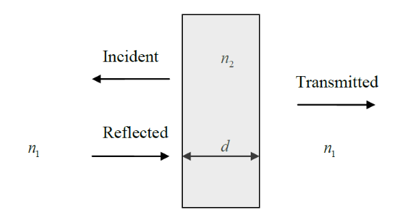
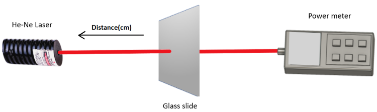

### Introduction

It is well-known that when an optical beam is incident normally from a medium with refractive index n1 onto another medium with refractive index n2, part of the beam is reflected and part of it is transmitted. Note that the incident beam encounters a single interface only. The reflectivity R1 and transmissivity T1 in this case are given by:

<b>R1\=Pr/Pi\=(n1\-n2/n1+n2)2       ----(1)</b>

<b>T1\=Pt/Pi\=1-R1\=4n1n2/(n1+n2)2       ----(2)</b>

Where Pi , Pr and Pt denote the incident, reflected and transmitted powers, respectively. The subscripts in R1 and T1 denote reflection and transmission through a single interface.

The situation becomes more involved when light passes through a slab of material with a non-zero thickness d , as shown in Figure below this paragraph. The refractive index of the slab is assumed to be 2 n and the refractive index of the surrounding material is assumed to be 1 n . This type of problem is different from the single interface problem shown in Figure1, because in this particular case, the light beam encounters two parallel interfaces, leading to multiple reflections inside the slab.

**Figure 1:Light Transmission and Reflection through a Slab with Two Parallel Interfaces**

According to theory, the transmissivity T2 of the slab shown in Figure above is given by:

<b>T2\=Pt/Pi\=(1-R)2/(1-R)2+4R1sin2δ       ----(3)</b>

Where R1 is the reflectivity of a single interface, which is given by equation (1), δ= kon2d = (2π/λ)n2d and λ is the free space wavelength. The subscript in T2 indicates the presence of two parallel interfaces.

According to equation (3), when the parameter δ is a multiple of π (i.e. δ=kon2d=0,π,2π,3π, ...) the transmissivity reaches a maximum value of 1. However, when δ is an odd multiple of   π/2 (i.e. δ=kon2d=0,π/2;,,3π/2,5π/2 ...) the transmissivity reaches a minimum value of (1-R1)2/(1+R1)2 . Thus the transmissivity T2 of the slab always lies in the range:

<b>(1-R1)2/(1+R1)2 <= T2 <= 1       ----(4)</b>

Let us assume that the slab is made of glass (n2 =1.50 ) and the surrounding medium is air (n1 =1.00 ). Using equation (1) results in R1 = 0.04. Then using equation (4), it is easy to show that T2 lies in the range:

<b>0.852 <= T2 <= 1.0       ----(5)</b>

Using equation (5), we can calculate range of the power loss in dB that an optical beam encounters when passing through a slab of glass:

<b>\-10log(0.852) >= dBLoss >= -10log(1.0)  </b>

<b>0.696 dB >= dBLoss >= 0dB       ----(6)  </b>

In this experiment, the power loss due to a glass slab in the form of a microscope slide will be measured in dB. Because the thickness _d_ of the microscope slide is _not uniform_ across the slide, the parameter δ changes value depending on the location where the light beam passes through the slide. This means that the power loss caused by the glass slide is also not uniform. However, according to theory this loss must always lie in the range given by equation (6). Also according to equation (6), the _mean_ loss of the glass slide equals (0+0.696) / 2 = 0.348 dB.

The gain an insight into how the slide thickness effect the transmissivity, let us note that a π/2 change in the parameter δ can cause the transmissivity to change from maximum to minimum or vice versa. For Δδ = π/2 = kon2Δd , we have Δd = (π/2)/(kon2 = λ/(4n2) = 0.6328/(4\*1.5) approx. 0.11µm. Thus a very small change in _d_ can lead to large changes in the transmitted power.

The objective of this experiment is to find out if the meter setting has an effect on the optical loss measurements.

**Figure 2: Set up for Optical Power Measurements**

